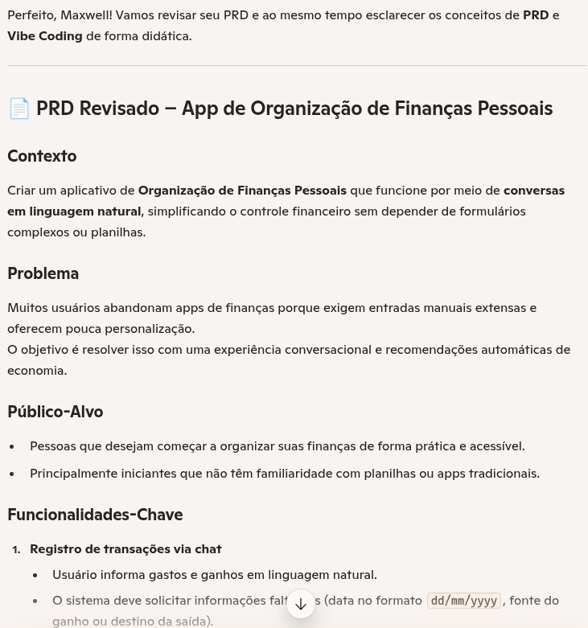
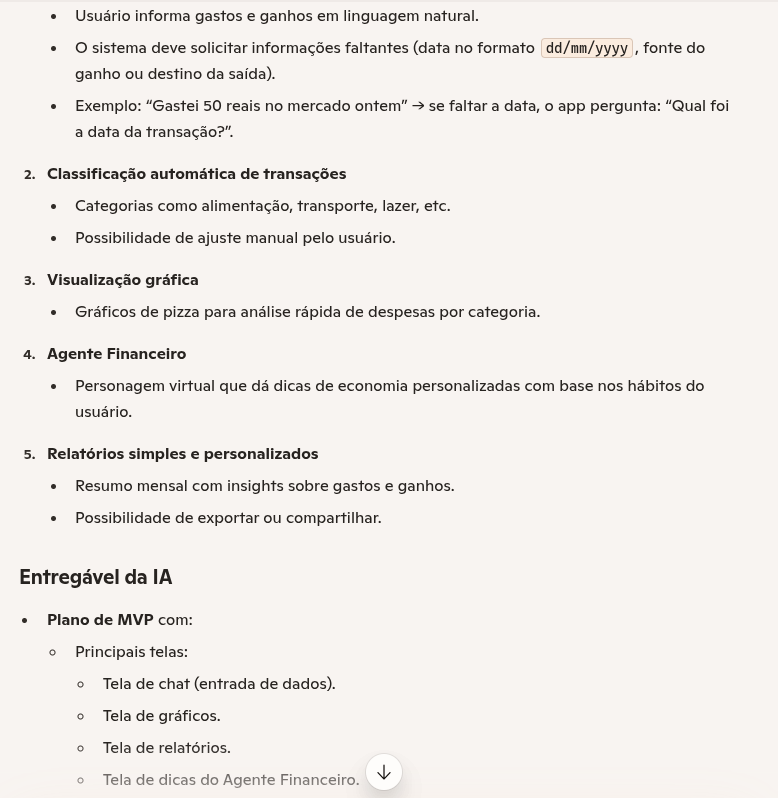
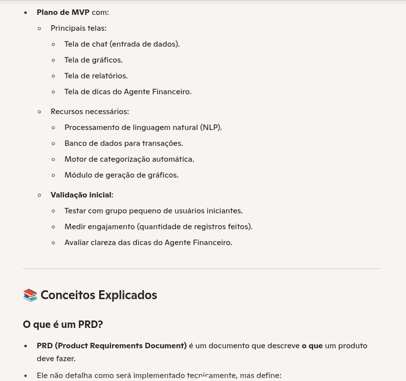
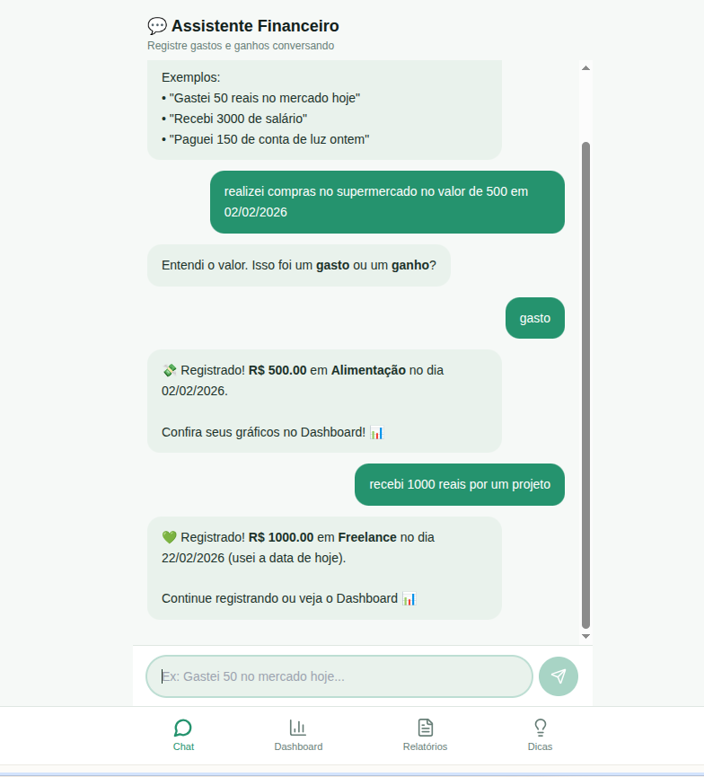
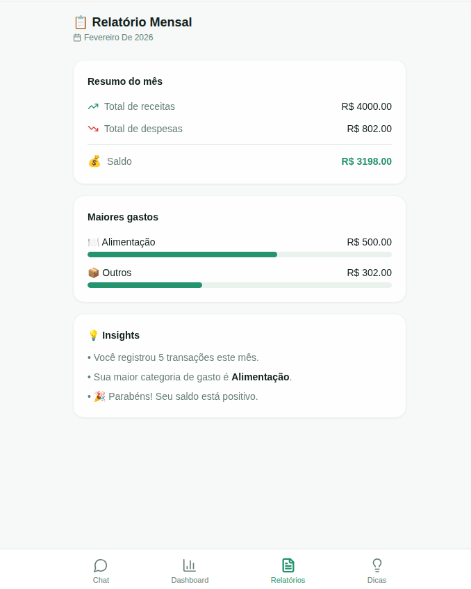
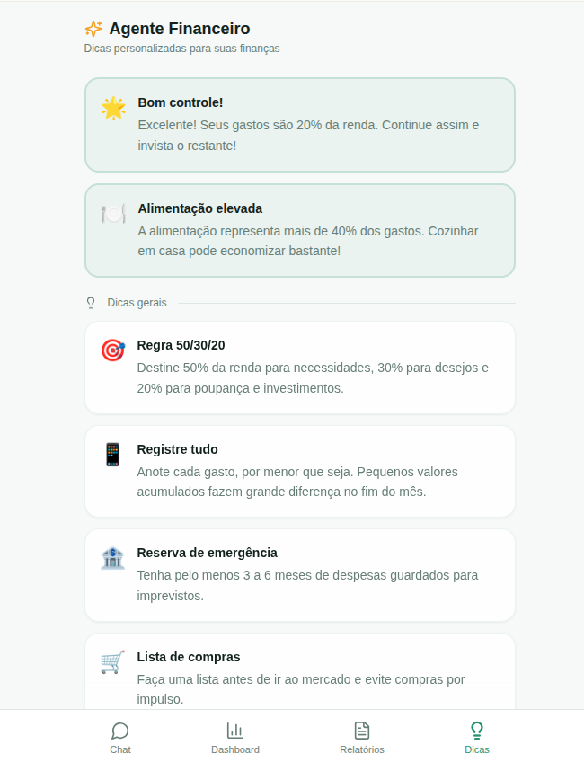

# 💸 App de Organização de Finanças Pessoais com Vibe Coding

Aprenda a **criar soluções com IA** de forma criativa, guiando ferramentas como o **Copilot** e o **Lovable** com uma comunicação simples e natural. O foco é desenvolver o conceito de um **App de Organização de Finanças Pessoais**, mas, acima de tudo, aprender o **jeito Vibe de programar com IA**.

## ✨ O que é Vibe Coding

**Vibe Coding** é uma forma leve e criativa de desenvolver com IA, baseada em **conversas naturais e bem estruturadas**. Você não precisa escrever código linha por linha. Em vez disso, aprende a **guiar a IA** descrevendo suas ideias de forma clara, com **intenção e contexto**. Em outras palavras:

> Você mostra a vibe da sua ideia e a IA transforma em solução (ou em um caminho para ela).

## 🎯 Desafio Concluído

### Prompt final (PRD):
```Prompt
PRD – App de Organização de Finanças Pessoais

Contexto
Criar um aplicativo de Organização de Finanças Pessoais que funcione por meio de conversas em linguagem natural, simplificando o controle financeiro sem depender de formulários complexos ou planilhas.

Problema
Muitos usuários abandonam apps de finanças porque exigem entradas manuais extensas e oferecem pouca personalização.
O objetivo é resolver isso com uma experiência conversacional e recomendações automáticas de economia.

Público-Alvo
- Pessoas que desejam começar a organizar suas finanças de forma prática e acessível.
- Principalmente iniciantes que não têm familiaridade com planilhas ou apps tradicionais.
- O aplicativo deve seguir princípios de Design Universal, garantindo que seja inclusivo e ofereça boa experiência para o maior número possível de usuários, independentemente de idade, nível de habilidade digital ou possíveis limitações.

Funcionalidades-Chave
1. Registro de transações via chat
   - Usuário informa gastos e ganhos em linguagem natural.
   - O sistema deve solicitar informações faltantes (data no formato dd/mm/yyyy, fonte do ganho ou destino da saída).
   - Exemplo: “Gastei 50 reais no mercado ontem” → se faltar a data, o app pergunta: “Qual foi a data da transação?”.

2. Classificação automática de transações
   - Categorias como alimentação, transporte, lazer, etc.
   - Possibilidade de ajuste manual pelo usuário.

3. Visualização gráfica
   - Gráficos de pizza para análise rápida de despesas por categoria.

4. Agente Financeiro
   - Personagem virtual que dá dicas de economia personalizadas com base nos hábitos do usuário.

5. Relatórios simples e personalizados
   - Resumo mensal com insights sobre gastos e ganhos.
   - Possibilidade de exportar ou compartilhar.

Entregável da IA
- Plano de MVP com:
  - Principais telas:
    - Tela de chat (entrada de dados).
    - Tela de gráficos.
    - Tela de relatórios.
    - Tela de dicas do Agente Financeiro.
  - Recursos necessários:
    - Processamento de linguagem natural (NLP).
    - Banco de dados para transações.
    - Motor de categorização automática.
    - Módulo de geração de gráficos.
  - Validação inicial:
    - Testar com grupo pequeno de usuários iniciantes.
    - Medir engajamento (quantidade de registros feitos).
    - Avaliar clareza das dicas do Agente Financeiro.
    - Verificar acessibilidade e usabilidade para diferentes perfis de usuários (Design Universal).

```

### Prints de interações com a IA:
<div style="text-align: center;">



</div>

---

### Resultado final no Lovable https://chat-and-chill-cash.lovable.app

### Resumo do App

#### O que funcionou bem
- **Clareza no PRD**: estruturar o documento ajudou a manter foco nas funcionalidades essenciais e facilitou a tradução das ideias em telas no Lovable.  
- **Experiência conversacional**: o uso de linguagem natural para registrar transações se mostrou intuitivo e reduziu a barreira de entrada para iniciantes.  
- **Visualização gráfica**: dashboards e relatórios mensais deram feedback rápido e motivador ao usuário.  

#### O que não funcionou como o esperado
- **Detalhes faltantes nas transações**: foi necessário pensar em como o sistema pedir informações complementares sem tornar a interação cansativa.  
- **Equilíbrio entre simplicidade e profundidade**: manter o app acessível para iniciantes, mas ao mesmo tempo útil para usuários mais avançados, exigiu ajustes.  
- **Design Universal**: perceber que não basta ter telas bonitas; é preciso garantir acessibilidade e usabilidade para diferentes perfis de usuários.  

#### O que aprendeu sobre conversar com IAs
- **Iteração rápida**: conversar com a IA ajudou a refinar ideias em tempo real, transformando conceitos soltos em requisitos claros.  
- **Didática e síntese**: a IA pode explicar conceitos complexos (como PRD e Design Universal) de forma acessível, o que acelera o aprendizado.  
- **Colaboração criativa**: a interação não é apenas técnica; é também uma forma de co-criar, testar hipóteses e receber feedback imediato.  

Em resumo, o processo mostrou que usar IA como parceira de design e planejamento é eficaz para estruturar ideias, mas exige atenção para validar se as soluções propostas realmente funcionam na prática com usuários reais.

### Telas do App 

---

---

---
